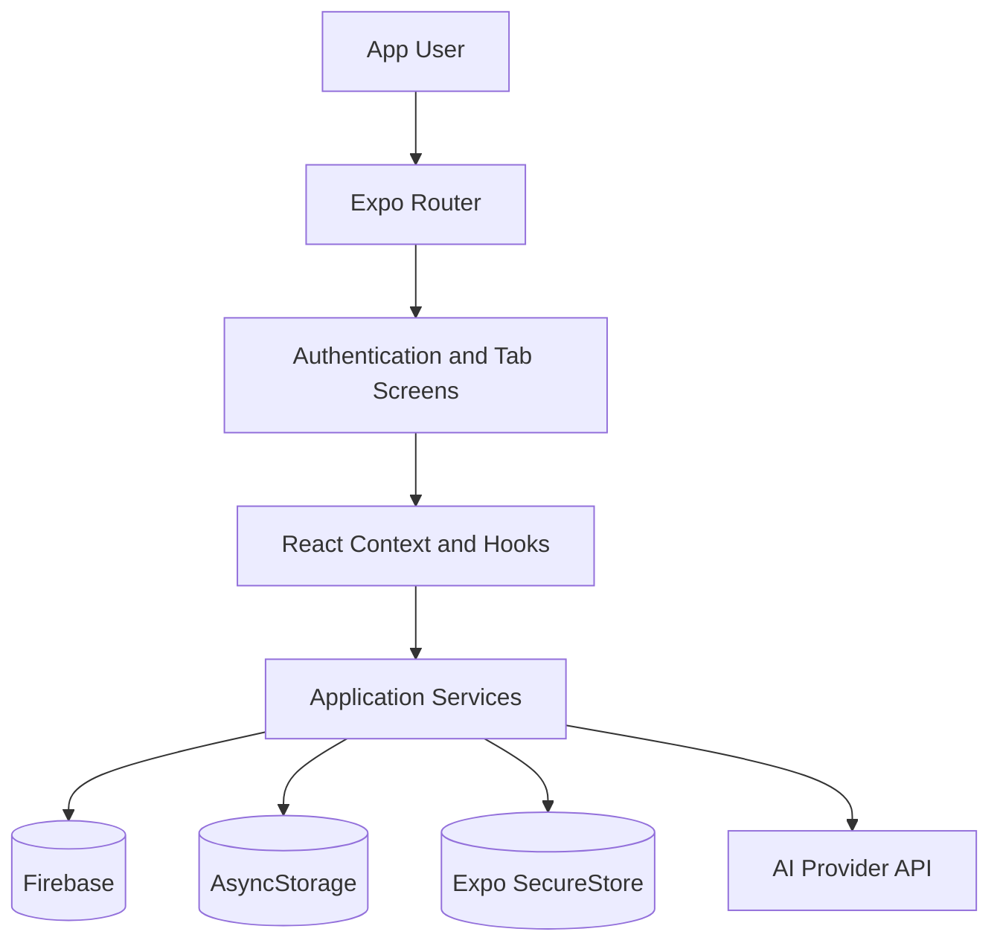

<div align="center">

# 🌿 Hitha App

### AI-Powered Mood, Diary & Wellness Companion

_Reflect gently. Track meaningfully. Grow one day at a time._

[](https://reactnative.dev/)
[](https://expo.dev/)
[](https://www.typescriptlang.org/)
[](https://firebase.google.com/)
[](LICENSE)

</div>

---

## 📖 About the Project

**Hitha App** is a cross-platform wellness application built with React Native, Expo, and TypeScript. It provides a calm personal space where users can record moods, write diary entries, work toward wellness goals, and interact with an AI-powered support assistant.

The application combines file-based navigation, Firebase services, local persistence, encrypted device storage, and a responsive interface that supports Android, iOS, and web.

> [!IMPORTANT]
> Hitha App is an educational wellness tool. It is not a medical service and does not replace professional diagnosis, treatment, counselling, or emergency support.

## 🧭 Quick Navigation

- [Key Features](#-key-features)
- [Technology Stack](#%EF%B8%8F-technology-stack)
- [Application Architecture](#%EF%B8%8F-application-architecture)
- [Project Structure](#-project-structure)
- [Getting Started](#-getting-started)
- [Available Scripts](#-available-scripts)
- [Privacy and Security](#-privacy-and-security)
- [Troubleshooting](#-troubleshooting)
- [Academic Information](#-academic-information)

## ✨ Key Features

| Module | Capabilities |
| --- | --- |
| 😊 Mood Tracking | Record daily moods, review history, and observe emotional patterns |
| 📖 Personal Diary | Create, categorize, revisit, and manage personal journal entries |
| 🤖 AI Support Chat | Communicate with an AI assistant through supported provider integrations |
| 🎯 Wellness Goals | Create goals, mark progress, and monitor completion |
| 🔐 Authentication | Register, sign in, and maintain protected user sessions |
| 🔢 App Lock | Protect access using a locally secured PIN |
| 👤 Profile | Manage profile information, preferences, security, and stored data |
| 🌓 Adaptive UI | Support automatic light and dark appearance settings |
| 📱 Cross-Platform | Run through a shared codebase on Android, iOS, and web |

## 🛠️ Technology Stack

| Area | Technologies |
| --- | --- |
| Mobile Framework | React Native 0.81.5, React 19.1 |
| Development Platform | Expo SDK 54, EAS Build |
| Language | TypeScript 5.9 |
| Navigation | Expo Router 6 with typed routes |
| Cloud Services | Firebase 12 |
| Local Storage | AsyncStorage, Expo SecureStore |
| UI & Media | Lucide React Native, React Native SVG, Expo Image |
| Animation & Gestures | React Native Reanimated, Gesture Handler, Worklets |
| Quality | ESLint, Expo ESLint configuration |

## 🏗️ Application Architecture



```text
User Interaction
      ↓
Expo Router → Screens → Context / Hooks → Services
                                      ↙    ↓    ↘
                              Firebase  Storage  AI Provider
```

## 📁 Project Structure

```text
AMD/
├── assets/                 # Icons, splash images, fonts, and media
├── scripts/                # Project utility scripts
├── src/
│   ├── app/                # Expo Router screens and layouts
│   ├── components/         # Reusable interface components
│   ├── config/             # Application and integration configuration
│   ├── constants/          # Shared constants and theme values
│   ├── context/            # Global React context providers
│   ├── hooks/              # Reusable custom hooks
│   ├── services/           # Storage, Firebase, and AI-related logic
│   └── global.css          # Global web styles
├── app.json                # Expo application configuration
├── eas.json                # EAS build profiles
├── eslint.config.js        # Code-quality configuration
├── package.json            # Dependencies and scripts
└── tsconfig.json           # TypeScript configuration
```

## 🚀 Getting Started

### Prerequisites

- Node.js 20 LTS or later
- npm
- Git
- Expo Go on a mobile device, or an Android/iOS emulator
- Firebase project credentials for connected cloud features
- API credentials for enabled AI providers

### 1. Clone the Repository

```bash
git clone https://github.com/jayanidissanayake15/AMD.git
cd AMD
```

### 2. Install Dependencies

```bash
npm install
```

### 3. Configure Integrations

Add the Firebase and AI provider configuration expected by the files under `src/config/`. Keep real API keys and service credentials outside version control.

### 4. Start the Development Server

```bash
npx expo start
```

Use the Expo terminal menu or QR code to open the application on a supported device.

## 📜 Available Scripts

| Command | Purpose |
| --- | --- |
| `npm start` | Start the Expo development server |
| `npm run android` | Open the project for Android development |
| `npm run ios` | Open the project for iOS development |
| `npm run web` | Run the web version |
| `npm run lint` | Check the source code with ESLint |
| `npm run reset-project` | Run the included project reset utility |

## 📱 Main Screens

| Screen | Purpose |
| --- | --- |
| Login & Registration | Create an account and access an existing profile |
| Home Dashboard | View a personalized wellness overview |
| Mood Tracker | Record and review daily moods |
| Diary | Create and manage personal reflections |
| AI Chat | Access the configured AI support experience |
| Goals | Create and monitor wellness goals |
| Profile & Security | Manage account, preferences, PIN, and local data |

## 🔐 Privacy and Security

- Sensitive local values should be stored with Expo SecureStore.
- General application state can be persisted through AsyncStorage.
- Firebase access must be protected using appropriate authentication and security rules.
- AI keys and other secrets must not be embedded directly in committed source code.
- Avoid sending unnecessary personal diary or mood information to external services.
- Provide clear user consent and data-deletion controls before production release.

> [!WARNING]
> If any credential has already been committed, remove it from the code and rotate it through the relevant provider dashboard.

## 📦 Build with EAS

Install and authenticate the EAS command-line tool, then select the appropriate build profile from `eas.json`:

```bash
npm install --global eas-cli
eas login
eas build --platform android
```

For iOS builds, use:

```bash
eas build --platform ios
```

## 🧪 Quality Checks

Run the configured linter before creating a build or opening a pull request:

```bash
npm run lint
```

## 🧰 Troubleshooting

| Problem | Suggested Fix |
| --- | --- |
| Dependencies fail to install | Delete `node_modules`, keep the lock file, and run `npm install` again |
| Expo cache causes stale errors | Run `npx expo start --clear` |
| App cannot connect to the development server | Keep the computer and device on the same network or use Expo tunnel mode |
| Firebase operation fails | Verify project configuration, enabled services, and security rules |
| SecureStore is unavailable on web | Use a platform-aware fallback for web-only development |
| AI chat returns an error | Confirm provider configuration, network access, and API limits |
| Native dependency mismatch appears | Run `npx expo install --fix` and restart Expo |

## 🎓 Academic Information

| Item | Details |
| --- | --- |
| Module | **ITS 2127 – Advanced Mobile Developer (AMD)** |
| Project | **Hitha App – AI-Powered Mental Health and Mood Tracking Mobile Application** |
| Student | **Malindi Rathnayaka** |
| Purpose | Educational and academic project |

## 📄 License

This project is distributed under the terms of the [MIT License](LICENSE).

---

<div align="center">

**⭐ If you find Hitha App useful, consider giving the repository a star.**

Built with React Native, Expo, and care for thoughtful digital wellbeing.

</div>
